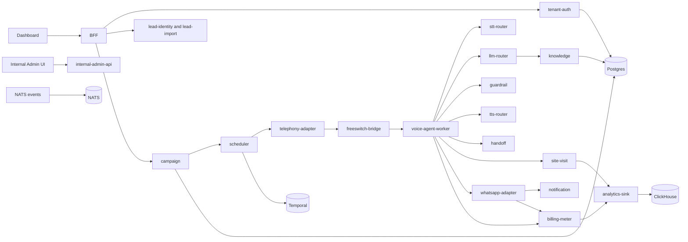

# Capsy Architecture

## Topology

## Service Inventory

Control plane:

- `bff`, `tenant-auth`, `lead-identity`, `lead-import`, `campaign`, `scheduler`
- `telephony-adapter`, `freeswitch-bridge`, `whatsapp-adapter`
- `handoff`, `notification`, `site-visit`, `billing-meter`, `analytics-sink`
- `model-config`, `internal-admin-api`, `temporal-workers`

AI plane:

- `stt-router`, `llm-router`, `guardrail`, `tts-router`, `voice-agent-worker`
- `knowledge`, `scoring`, `eval-harness`

Apps:

- `apps/dashboard`
- `apps/internal-admin-ui`

## Data Model Overview

Core tenants own users, projects, KB versions, campaigns, leads, call sessions, WhatsApp threads, site visits, billing accounts, and audit events. AI outputs are versioned with prompt, model, KB, guardrail, and transcript evidence. Analytics events flow into ClickHouse for reporting.

## Event Flow

1. Campaign launch schedules lead outreach.
2. Telephony adapter places calls and streams media through FreeSWITCH.
3. Voice agent runs VAD, STT, LLM with RAG, guardrail, and TTS.
4. Actions publish events for handoff, WhatsApp, callbacks, site visits, lead status, billing, and analytics.
5. Dashboard and internal admin read operational views from service APIs and analytic sinks.

## Latency Budget

- Telephony bridge frame handling: under 50 ms overhead
- STT first result: target under 1500 ms
- LLM router: managed fallback under 1500 ms for short turns
- Guardrail: under 150 ms
- TTS first chunk: target under 200 ms
- End-to-end turn response: target under 3 seconds

## Compliance Posture

- DPDP consent ledger for outreach attempts
- TRAI calling-window and 140-series gates
- RERA and approved-KB campaign gates
- Audit logging for internal admin and destructive operations
- Vault path isolation for provider credentials
- Demo mode blocks real external side effects
- Security audit harness in `tests/security`
